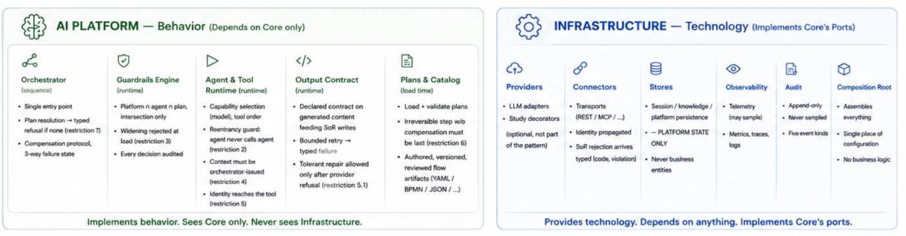
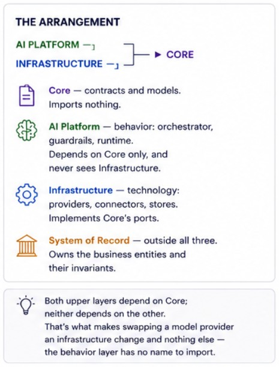
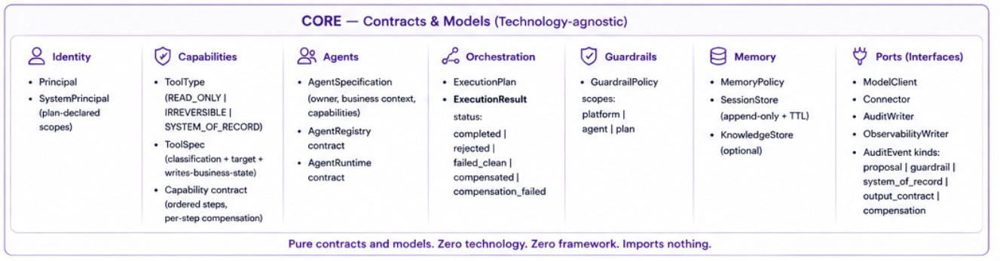

# ARCHITECTURE — why each component exists, and what would break without it

This document answers exactly one question per component: **what forces it to
exist**. It repeats no contract — no signatures, no fields, no types; for
those, every block links to [`DESIGN.md`](DESIGN.md) (the source of truth).
If a statement here could diverge from the code, it belongs in DESIGN, not
here. Findings and measured behavior live in [`NOTES.md`](NOTES.md); the
thesis and evidence summary in [`README.md`](README.md).

Reading key: *Authority* names which of the three separated authorities the
component protects — **sequence** (a human decides order), **authorization**
(policy decides permission), **validity** (the domain decides business truth) —
or *support* when it enables the others without owning a decision.

*Visual companion (click to zoom). The poster is pattern-level and
technology-agnostic; where it shows more than this repository implements
(input/output guardrail moments, generic plan syntax), the honest scoping in
the blocks below and in README's poster caption governs.*

**Poster box → folder on disk.** The poster names components conceptually;
the repository names files. The map, so nobody has to reverse-engineer it:

| Poster | On disk |
|---|---|
| Core (Contracts & Models) — Identity, Capabilities & Tools, Agents, Orchestration, Guardrails, Memory, Ports | `src/core/` — exactly those seven modules, one file each |
| AI Platform — Orchestrator | `src/ai/orchestrator.py` (plan loading + validation live here too — there is no separate registry file) |
| AI Platform — Guardrails Engine | `src/ai/guardrails.py` + `src/ai/guardrail.yaml` (platform scope) |
| AI Platform — Agent & Tool Runtime | `src/ai/agents.py` — one module holding AgentRegistry, ToolRegistry and AgentRuntime (merged in the structure simplification; classes stayed separate) |
| AI Platform — Plans (YAML) | `src/ai/plans/*.yaml` |
| AI Platform — Memory & Context | `src/ai/context.py` (contracts and policy in `src/core/memory.py`) |
| Plan / Agent / Capability / Tool cards | `src/ai/agents/<agent>/` — data folders (`agent.yaml`, `guardrail.yaml`, one `.py` per capability with its `@tool` functions inline). **Deliberate quirk, and its trap:** `ai/agents.py` (module) and `ai/agents/` (data folder) share a name; the data folder has no `__init__.py` at any level, so `import ai.agents` resolves to the module. **Adding an `__init__.py` anywhere under `ai/agents/` shadows the module and silently breaks every platform import** — it is the one part of the tree that fails without an error at the place you touched. See DESIGN § *ai/ — behavior* and the module docstring in `src/ai/agents.py` |
| Infrastructure — LLM Providers | `src/infrastructure/providers/` — local + Gemini/Anthropic/OpenAI, plus four decorators (recording, fault-injection, schema-stripping, tolerant-repair) that are **study instrumentation, not part of the pattern**: they wrap the same `IModelClient` seam to run the experiments, and a production adoption would ship without them |
| Infrastructure — Connectors | `src/infrastructure/connectors/{rest,mcp}/` |
| Infrastructure — Memory & Stores (Session / RAG-Knowledge) | `src/infrastructure/memory/` — in-memory/Redis session store, local vector knowledge store, and the Postgres/pgvector variants selected by configuration |
| Infrastructure — Observability | `src/infrastructure/observability/` |
| Infrastructure — Audit (append-only) | `src/infrastructure/audit/audit_store.py` (JSONL + Postgres writers) |
| Infrastructure — Configuration & DI | `src/infrastructure/configurations.py` — the composition root; its entry function is `build_platform` (signature in DESIGN) |
| System of Record | `erp_service/` — **outside `src/` on purpose**; the platform container has no import path to it |
| Entry Channels | not in the repository — outside the pattern's scope, exactly as the poster states |

---

## AI Platform layer

### Orchestrator

**Responsibility.** The platform's single entry point: resolves the plan
(explicit or model-selected, else typed refusal), issues the execution
context, runs plan steps in declared order, and runs the compensation
protocol on failure.

**Why it exists.** The three authorities need one choke point where they all
apply — a place where every request meets the plan catalog, the policy, and
the audit trail before anything runs. Distribute that and each entry path
becomes its own partial reimplementation.

**Without it.** Channels invoke agents directly: composition gets improvised
per channel, refusal-of-the-unknown (restriction 7) has no owner, and the
audit trail fragments into per-channel logs. The deployment makes the entry
rule structural: a channel has no other way in (restriction 4), and the
platform container separately carries no path to business storage at all.

**Authority.** sequence (and the meeting point of all three).

**Contract.** → DESIGN § *ai/orchestrator.py — the platform's single entry
point*.

### Plan catalog (honestly: a loading function, not a registry class)

**Responsibility.** Loads `plans/*.yaml` into a validated catalog at startup
and rejects invalid sequences before anything can run — restriction 6
(irreversible step without compensation must be last) is checked here.

**Why it exists.** Load-time validation is the pattern's mechanism for moving
sequence errors from incidents to pull requests. Something must be the moment
"this plan is admissible" is decided, and it must happen before the first
request.

**Without it.** Restriction 6 becomes a runtime surprise: the first execution
that fails mid-plan discovers there is no compensation for an already-fired
irreversible step — at 3 a.m., against a customer. (NOTES records this
working: the *first natural draft* of the inbound-email plan was rejected at
load — § Where the structure resisted, #4.)

**Honesty note.** There is no `PlanRegistry` class; the "registry" is
`load_plans()` producing a dict consumed by the Orchestrator. At two plans,
a class would be ceremony. A larger catalog (the N=40 sweep points at
catalog scoping/prefiltering) is where a real registry would earn its place.

**Authority.** sequence.

**Contract.** → DESIGN § *ai/orchestrator.py* (plan loading) and § *ai/plans/*.

### Agent Registry

**Responsibility.** Scans each agent's declarative specification into the
catalog the runtime and guardrails work from.

**Why it exists.** The pattern requires every agent to be *anchored*: a named
owner, a business context, an explicit capability list. That anchoring must
be data — reviewable, diffable — not an emergent property of what code
happens to be imported.

**Without it.** Agents exist wherever code constructs them; "which agents can
run here, and who answers for this one?" has no queryable answer, and
per-agent guardrail scoping loses its subject.

**Authority.** support (it gives authorization and audit their subject).

**Contract.** → DESIGN § *ai/agents.py — AgentRegistry* and § *Specifications
(data)*.

### Agent Runtime

**Responsibility.** Executes one agent invocation: model-selects the
capability (confined non-determinism), then runs the capability's tool steps
in their hardcoded order, enforcing the guardrail, identity propagation, the
reentrancy guard, and the orchestrator-issued-context check.

**Why it exists.** This is where the two hard prohibitions become mechanical:
agents never call agents (restriction 2 — reentrancy guard), and nothing
reaches an agent except through the Orchestrator (restriction 4 — context
check). Both must live *inside* the execution path; a rule that execution
itself doesn't check is a convention.

**Without it.** Agent-to-agent calls appear the first time they're convenient,
and composition migrates from reviewed plans into runtime call graphs — the
exact failure the Akka "golden rule" and restriction 2 exist to prevent.

**Authority.** sequence (intra-agent) + the enforcement point for
authorization and identity (restrictions 3's evaluation and 5's propagation
happen per step, here).

**Contract.** → DESIGN § *ai/agents.py — AgentRuntime*.

### Context (ContextBuilder)

**Responsibility.** Deterministically assembles what the model sees —
instructions, optional knowledge, bounded session history, payload — and
compacts it under a token budget with a deterministic drop order.

**Why it exists.** Confining non-determinism to selection and generation only
works if the *inputs* to those calls are themselves reproducible. Ad-hoc
prompt assembly is where hidden state and ordering drift leak in.

**Without it.** Two executions of the same plan with the same data can see
different contexts, and "the model never sequences" quietly erodes into "the
model sees whatever this call site assembled". Memory policy (what an agent
may remember) would also have no enforcement point.

**Authority.** support (it keeps the confinement honest).

**Contract.** → DESIGN § *ai/context.py* and § *core/memory.py*.

### Guardrails (engine + evaluator)

**Responsibility.** Composes platform ∩ agent ∩ plan policies by
intersection, rejects any narrower scope that tries to widen at load, and
turns every allow/deny into an audit event.

**Why it exists.** The authorization authority needs the same property the
other two have: *checkable before run, monotone under composition*.
Intersection-only composition is what makes "adding an agent can never add
permission" a theorem instead of a review comment.

**Without it.** Policy becomes additive by accident — an agent-level config
grants what the platform never did — and permission drift is discovered
forensically. (This is IAM's permission-boundary lesson imported into the
agent platform: AWS IAM's permission boundaries, where effective permissions
are the intersection.)

**Honesty note.** Plan-scope guardrails are supported and tested but no
in-repo plan declares one (NOTES, bend #8) — the third scope is currently
exercised by synthetic policies only. And a `GuardrailDenied` currently
surfaces to callers under the same rejection code as a business-invariant
violation — the distinction lives in the audit trail, not the return code
(NOTES, bend #9).

**Authority.** authorization.

**Contract.** → DESIGN § *ai/guardrails.py — single engine, three scopes*.

### Tool Registry

**Responsibility.** Registers every tool with its guarantee classification
and rejects, at registration, the two structural violations of the validity
separation: a business-writing tool not classified `SYSTEM_OF_RECORD`, and a
`SYSTEM_OF_RECORD` tool whose target is a platform-side store.

**Why it exists.** The thin-platform rule ("no business entity platform-side")
is only as strong as its earliest checkpoint. Registration is the earliest
moment a write path can be inspected — before any plan, any request, any
model call.

**Without it.** The validity separation becomes documentation: the first
convenient in-memory "temporary" business store appears, agent memory becomes
a shadow record, and the platform is a second, unvalidated system of record —
the structural feature shared by the incident class in DESIGN's Motivation.

**Authority.** validity.

**Contract.** → DESIGN § *ai/agents.py — ToolRegistry* and § *core/capabilities.py*.

---

## Declarative artifacts

### Plan

**Responsibility.** A human-authored, versioned sequence of agent invocations
with entry scopes, per-step compensation, and output mapping. Plans name
agents and intents — never capabilities or tools.

**Why it exists.** It is the sequence authority's *artifact*: the thing a
human writes, a reviewer diffs, and load-time validation checks. Its
indirection (agents only) is what keeps agent internals swappable without
touching reviewed business flow.

**Without it.** The model composes the flow per run — Plan-and-Execute
territory, where the plan is generated, unreviewable, and different every
time. Every neighbor that keeps an LLM in the loop for orchestration accepts
exactly this; the measured cost of refusing it is in the README table.

**Authority.** sequence.

**Contract.** → DESIGN § *ai/plans/ — 2 plans*.

### Agent Specification

**Responsibility.** Declares an agent's identity: owner, business context,
goal, instructions, capability list, memory policy.

**Why it exists.** Accountability requires a subject: guardrails scope *per
agent*, audit attributes *per agent*, and organizational ownership must
survive team turnover. Data with a diff history does that; code structure
does not.

**Without it.** "Who owns this agent's behavior" becomes archaeology, and
narrowing policy per agent has nothing stable to attach to.

**Authority.** support (subject of authorization and audit).

**Contract.** → DESIGN § *Specifications (data)*.

### Capability

**Responsibility.** Code declaring a cohesive business capability: an ordered
tool sequence with dependencies, optional inference steps, and per-step
compensation.

**Why it exists.** Tool order is sequence authority too — just at the layer
where it must interleave with code-level data flow. Putting it in code (not
prompts, not model output) makes intra-agent order as deterministic as
inter-agent order.

**Without it.** Tool order lives in prompts — a suggestion, not an invariant
(Bassim Eledath's "Invariant Engineering" formulation) — and the
model's tool-call whims become the de-facto flow.

**Honesty note.** Intra-capability compensation (`Step.compensate`) is part
of the contract but **no in-scope agent exercises it** — the fixed tool list
gives `Book` nothing to compensate with; only plan-level compensation is
exercised end-to-end (NOTES, bend #3). A stricter reading would cut it until
an agent needs it. It stays because the contract requires the slot, not
because this repo proves it.

**Authority.** sequence (intra-agent).

**Contract.** → DESIGN § *Specifications (data)* and § *core/capabilities.py*.

### Tool

**Responsibility.** The atomic unit of effect, carrying its guarantee
classification (`READ_ONLY` / `IRREVERSIBLE` / `SYSTEM_OF_RECORD`) and its
target.

**Why it exists.** The classification is the vocabulary the whole validity
separation is written in: the registry checks it, guardrails filter on it,
audit records by it. Without a *typed* write-path distinction, "writes go
through the system of record" is a sentence, not a check.

**Without it.** Every tool is just a function; the three-way risk distinction
(read / can't-undo / owns-business-truth) exists only in reviewers' heads.
MCP's own annotations show the alternative: untrusted hints, explicitly not
guarantees — per the MCP maintainers themselves.

**Authority.** validity (and the object authorization filters on).

**Contract.** → DESIGN § *core/capabilities.py* (ToolType, ToolSpec).

---

## Boundaries

### Core (contracts *and* models, stdlib only)

**Responsibility.** Every boundary contract and every cross-layer model, with
zero third-party imports — verified by an AST test, not convention.

**Why it exists.** Dependency direction is what makes the seams real: `ai`
and `infrastructure` depend on `core`, never the reverse. Models live here
*with* the contracts because data that crosses layers born anywhere else
would invert the arrow (NOTES, § Where the structure resisted, #2).

**Without it.** Swapping a provider or connector stops being an
infrastructure change; the platform's behavior layer starts importing
technology, and "the pattern survives a stack swap" — the acceptance
criterion of this very document — dies first.

**Authority.** support (it makes all three separations testable).

**Contract.** → DESIGN § *Layers and dependencies* and § *core/ — contracts*.

### Infrastructure (and why the composition root lives here)

**Responsibility.** Everything technological — model providers, connectors,
stores, observability — plus the composition root that assembles the
platform.

**Why it exists.** Exactly one layer is allowed to know everything, and it
must be the outermost one: the composition root needs to touch every
concrete class, so it can only live where depending on everything is legal.
It is also where measurement instrumentation (recording, fault injection,
schema stripping, tolerant repair) plugs in — decorators over the same
seams, deliberately outside the pattern's own layers.

**Without it.** Construction knowledge leaks inward; `core`/`ai` acquire
imports that make the AST test fail — or, without that test, make the
dependency rule quietly fictional.

**Authority.** support.

**Contract.** → DESIGN § *infrastructure/*.

### System of Record (external, outside `src/`)

**Responsibility.** The business system — owns the business tables, enforces
the invariants by database constraint, rejects violations with typed errors.
Deployed as its own service; the platform container reaches it by HTTP only.

**Why it exists.** The validity authority must be *structurally* outside the
thing that generates content — that is the whole custody argument, and the
matrix measured what happens at that boundary. Being a separate deployable is
what upgrades restriction 4 from in-process verification to a real wall
(NOTES, bend #5).

**Without it.** The platform validates its own writes — generator and judge
collapse into one party. Cell A is the measured picture of that collapse
(`gemini-3.1-flash-lite`): `completed` 10/10, counters at zero, ten garbage
rows. And the platform
drifts into being a second system of record, which is the un-solving of the
n-tier discipline DESIGN's Motivation documents.

**Authority.** validity.

**Contract.** → DESIGN § *The business system: `erp_service/`*.

---

## Components that do not exist (considered, and why not)

- **A cost-budget owner.** There is no component that meters or caps spend.
  What exists: per-step *call-count* limits in guardrail YAML
  (`max_model_calls_per_step`, `max_tool_calls_per_step`), a per-call token
  budget in the ContextBuilder, and cost-per-completed-task as the study's
  primary *metric* — measured, not governed. At this scale (bounded calls per
  plan, fractions of a cent per task) a budget authority had nothing to
  decide. A production deployment with open-ended catalogs would likely need
  one; it would compose as a fourth guardrail limit, not a new authority.
- **Creator-Verifier as a plan step.** Fully compatible with the pattern — a
  plan may sequence a verifier agent after a creator agent, and typed
  handoffs make the wiring natural — but no in-scope flow needs it, so it was
  not built (golden rule: nothing the three agents don't exercise). The
  narrow slice a verifier would cover for *contract* validity is already
  owned by the output-contract guard; content *quality* verification remains
  out of scope and honestly flagged as such in README's limitations.
- **An anti-corruption / vocabulary-translation layer between agents and the
  system of record.** Deliberately absent: capabilities call the SoR's API
  directly, and the SoR's own validated API *is* the anti-corruption
  boundary. A platform-side translation layer would be a place for business
  logic to accumulate — precisely what the thin-platform rule forbids. (The
  Thoughtworks ACL-as-agent-skill framing and Workday's write-back governance
  are the neighbors of this decision.)
- **An ambiguity detector in selection.** Proposed by this study's own data —
  the sweep's constant ~75% floor on genuinely ambiguous intents argues for
  *clarify-or-refuse* instead of silent choice — but unbuilt and unmeasured.
  It is the pattern's own recommendation to itself (README, § Honest
  limitations; NOTES, § Large-catalog selection sweep, verdict).

---

*Cross-reading check:* every claim above traces to DESIGN (contracts), NOTES
(bends #3, #5, #8, #9; resisted #2, #4) or README (limitations, guarantees) —
no contract is restated, and the honesty cases carry the same verdicts
recorded there. External neighbors are named inline with their sources.
