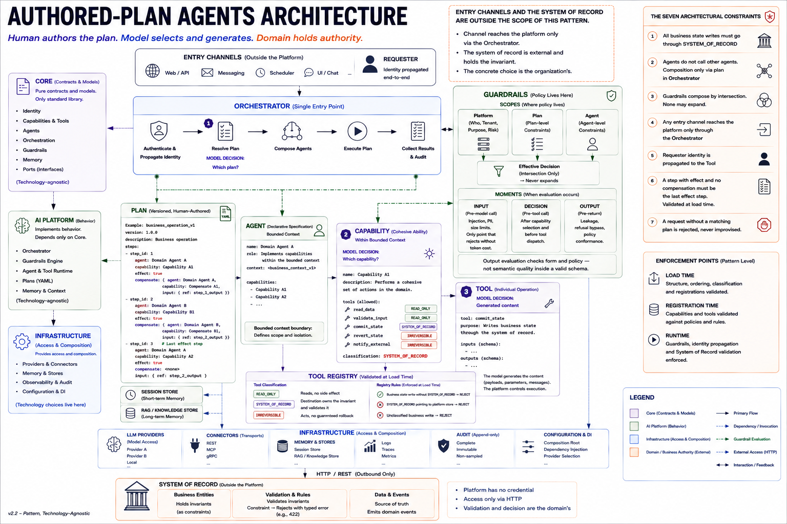
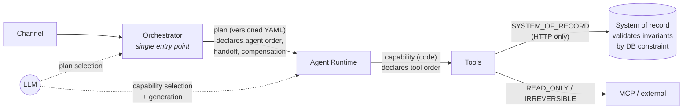

# Authored-Plan Agents
### An architectural pattern for LLM agent platforms with separated execution, policy, and domain authority — reference implementation & measurement study

## The incident this pattern prevents

Ten times in a row, an agent reported success. Ten times, the business database
received garbage — a double-fenced JSON blob stuffed into a customer-facing
field, `status='open'`, indistinguishable from a legitimate record to any
downstream consumer. And the platform's own contract counters read **zero
violations**: the tolerant parser "repaired" every response before any check
could see it. This is measured, controlled and reproducible in this repository
(integrity-matrix cell A — `results/integrity-matrix/integrity_matrix*`, [`NOTES.md`](NOTES.md)
§ Integrity matrix), and it is not exotic: in the public incident record,
[188 of 7,246 AI incidents (2023–2026) are autonomous systems harming
production with **no attacker in the chain**](https://www.cyera.com/research/agent-inflicted-damage-inside-the-real-world-failures-of-enterprise-ai-systems),
and false success — the agent's narrative diverging from the record — measures
at [45–78% of agent failures](https://arxiv.org/abs/2606.09863).

**Why the obvious fixes don't close it:**

- **Guardrails don't catch it.** In the incident above, every authority
  restriction held — identity propagated, policy passed, the target validated
  its invariants — and corrupted content persisted anyway. Content integrity
  is orthogonal to authorization.
- **Schema validation catches form, not meaning.** The garbage rows entered
  through the business API and satisfied it; syntax *repair* is precisely what
  concealed the violation. Repair fixes syntax, not semantics.
- **Testing doesn't catch it.** The model is non-deterministic: the failing
  output shape appears in production, not in your fixtures — and both the
  agent's report and the platform's telemetry can read clean while the
  database is wrong. The only ground truth is the persisted record.

## The pattern: three authorities, separated

Each failure mode above is one party deciding something it cannot guarantee.
The pattern separates the three decisions and gives each to the party that can:

| Decision | Authority | Mechanism |
|---|---|---|
| **Sequence** — what runs, in what order | **a human** | authored, versioned plan (YAML) declares agent order; capability code declares tool order. The model selects among plans and generates content — **it never sequences** |
| **Authorization** — may this run, now, for this principal | **policy** | guardrails in three scopes (platform/agent/plan), composed by **intersection**; widening is rejected at load |
| **Validity** — is this business truth | **the domain** | business-state writes only through `SYSTEM_OF_RECORD` tools; the target owns and enforces its invariants; **the platform holds no business entity** |

> **The name:** the *plan* is what gets authored — by a human, versioned,
> reviewed in a pull request. The authored plan is one of the three
> authorities (sequence), not the whole thesis: swap YAML for BPMN or JSON and
> the pattern stands — the essence is the separation, not the plan's format.

## Architectural guarantees

Given the seven restrictions hold (each enforced by a test that also *commits
its violation* in a strict-xfail probe), the architecture guarantees — each
with the evidence that measured it:

| Guarantee | Evidence |
|---|---|
| Execution order is deterministic; the model selects and generates, never sequences — model-call count per execution is **bounded** and known in advance (the strict guard adds at most one retry call per violation) | restrictions 2, 6 (tests); every recorded run shows the bounded per-plan call shape (`results/runs/run-*.json`, `results/integrity-matrix/integrity_matrix.jsonl`) |
| Business validity is decided outside the platform — no business entity exists platform-side | restriction 1 (tests) + persistence tests: the platform container has no path to business storage; `erp_service/` holds the only business tables |
| No policy composition ever widens permission | restriction 3 (test): intersection-only, widening rejected at load |
| Business state is never written except through the system that owns and validates the invariant, and its rejection reaches the agent typed | restriction 1 + persistence test (ERP 422 → typed `ConnectorRejection`); every matrix write path went through the ERP API |
| A generation-contract failure never persists unvalidated content | integrity-matrix cell B: `failed_clean` 10/10, **zero rows**; provider-dialect accident: 10/10 typed failures, zero rows (`results/runs/run-20260727-215429.json`) |
| Every decision is auditable, unsampled — proposal, guardrail, system-of-record, output-contract, compensation, including compensation's own failure with the orphaned state | five-kind audit vocabulary; persistence test `test_compensation_failure_is_audited_with_orphaned_state`; audit trails in `results/runs/` and `results/integrity-matrix/` |

*Scope, honestly:* these are architectural guarantees under the stated
restrictions — verified in-process and at the container boundary. They are
**not** a security boundary against an in-process attacker (NOTES, bend #5),
and **not** a guarantee of content quality inside a valid schema (that residue
is what the output-contract guard bounds, and the matrix measures).

This repository is an academic study in three artifacts: a minimal end-to-end
platform that implements the pattern, a test suite that enforces its
restrictions (rather than documenting them), and three cycles of real-model
measurement that refined the pattern against its own evidence.

## Key results (measured, not claimed)

| Measurement | Result | Evidence |
|---|---|---|
| **False success with real persistence** — prompt-only generation on a flash-tier model | 10/10 executions reported success while persisting corrupted business records; **0/10** after decoding-level structured output + `retry_once_then_fail`, at **−18% cost** | [`NOTES.md`](NOTES.md) § Structured output correction, [`results/`](results/) |
| **Integrity matrix 2×2** — decoding constraint × boundary policy, single controlled condition (same codebase, same model, fault injected where the schema is stripped) | With a real schema both boundary policies are clean (the repair axis has nothing to do). Without it, the boundary alone decides: tolerant repair → `completed` 10/10 with **10 garbage rows and audit counters reading zero**; strict guard → `failed_clean` 10/10, **zero rows persisted** | [`NOTES.md`](NOTES.md) § Integrity matrix — controlled reproduction, `results/integrity-matrix/integrity_matrix*`, per-cell DB snapshots `results/integrity-matrix/matrix-*.sqlite` (cell A's garbage rows are directly inspectable) |
| **Failure stays loud** — a provider schema-dialect bug hit the corrected pipeline | 10/10 **typed, unpersisted** failures (vs. the original 10/10 silent corruptions for the same class of surprise). Their recorded status `compensated` predates the 3-way failure vocabulary and is itself flagged as misleading for this fault shape — see NOTES § Structured output correction | `results/runs/run-20260727-215429.json` |
| **Selection at catalog scale** (N = 2→40 plans, real model) | Clear intents: 100/100/100/100/95%. Ambiguity is a **~75% floor, not a slope** — aggregate decline is eval-composition, not catalog size. Out-of-catalog refusal: **100% at every N**. Keyword routing on the same set: ≈0% | [`NOTES.md`](NOTES.md) § Large-catalog selection sweep (N = 2..40), `results/selection-sweep/selection_sweep*` |
| **Compensation over persisted state** — incl. failure of the compensation itself | Orphaned row remains in the ERP's SQLite but is now fully traceable from the audit trail alone (`compensation` events carry the orphaned state) | [`NOTES.md`](NOTES.md) § Persistence and real boundary |
| Cost per completed task (gemini-3.1-flash-lite) | $0.000058 (no-generation plan — 100% selection overhead) to $0.000247 (two-agent plan) | `results/runs/run-20260727-215811.json` |

All real-model measurements ran **inside a free-tier quota** (~$0.06 at list
price), which is itself a claim: the methodology is reproducible without a
budget.

## The pattern at a glance

[](docs/authored-plan-agents-architecture.png)

*Full poster (click to zoom): the three model decisions (① which plan, ② which
capability, ③ generated content), the seven restrictions (styled
"constraints" in the poster), and the load/registration/runtime enforcement
points. The poster is **pattern-level and technology-agnostic** (v2.2): its
plan snippet uses illustrative syntax, and its input/output guardrail
"moments" (injection, PII, leakage) describe the pattern's full surface — the
reference implementation exercises the **decision** moment (pre-tool policy on
types, targets and limits); see `ARCHITECTURE.md` for what exists here versus
what the pattern admits.*



**Concepts.** A *Plan* is a human-authored, versioned YAML sequence of agent
invocations (never referencing capabilities or tools). An *Agent* is
declarative data anchored to a business context with a named owner. A
*Capability* is code declaring a tool sequence with dependencies and
compensation. A *Tool* is classified by guarantee: `READ_ONLY` (reads),
`IRREVERSIBLE` (no guaranteed rollback), `SYSTEM_OF_RECORD` (every write path; the
target is a business system that validates its own invariants — never a
platform store).

**Seven restrictions — the three separations made checkable** (one test each,
plus a strict-xfail anti-vacuity suite that commits each violation on purpose;
the bracket names the authority each restriction protects):

1. *[validity]* Business-state writes only through `SYSTEM_OF_RECORD` tools; system-of-record targets cannot be platform stores.
2. *[sequence]* Agents never call agents — composition exists only in plans, executed by the single Orchestrator.
3. *[authorization]* Guardrails compose across three scopes (platform/agent/plan) by **intersection**; widening is rejected at load.
4. *[sequence]* Channels reach the platform only through the Orchestrator (made structural by the deployment boundary — the platform container carries no path to business storage).
5. *[authorization]* Identity propagates to the tool; without a user, a `SystemPrincipal` carries plan-declared scopes.
6. *[sequence]* An effectful step without compensation must be the last effectful step — validated at plan load.
7. *[sequence]* A request with no matching plan is refused, typed — never improvised. (Measured: 100% out-of-catalog refusal at every catalog size.)

Audit is separate from telemetry: complete, never sampled, with a five-kind
vocabulary — what the agent **proposed**, what the **guardrail** decided, what
the **system-of-record** target validated, what the **output contract**
enforced, and what **compensation** did (including the orphaned state when
compensation itself fails).

## Getting started

Requires Python ≥ 3.14. No API keys are needed for the full test suite or the
default run (a deterministic local model client and stub connectors stand in).

```bash
python -m venv .venv && . .venv/bin/activate   # Windows: .venv\Scripts\activate
pip install -e ".[dev]"

# Expected: "18 passed, 7 xfailed" — 18 tests (7 restrictions + dependency
# direction + persistence + e2e) plus 7 strict-xfail probes that try to
# violate each restriction on purpose (an XPASS would mean an unenforced rule)
pytest tests/ -q

# Run both reference plans end to end (local provider, in-process ERP, $0)
python scripts/run_plans.py --erp inprocess
```

**Real-model measurement** (any of Gemini / Anthropic / OpenAI):

```bash
cp .env.example .env            # fill in the key(s) you have
python scripts/run_plans.py --provider gemini --repeat 10 --erp inprocess
python scripts/selection_sweep.py --provider gemini   # catalog-scale sweep, resumable
```

The runner prints per-execution tokens, cache reads, latency, selection
distribution, output-contract counters and **cost per completed task**, and
writes `results/runs/run-<timestamp>.json`. The sweep checkpoints every data point
(`results/selection-sweep/selection_sweep.jsonl`), so free-tier daily quotas only pause it.

**Docker** (three services — the platform container has *no* path to business
storage; its only channel to the ERP is HTTP):

```bash
docker compose up   # postgres-platform (pgvector) + erp (SQLite volume) + aici
```

## Repository layout

```
src/core/            contracts and models — stdlib only (7 modules; boundary ports in ports.py)
src/ai/              behavior — imports core only: orchestrator, guardrails, context,
                     agents.py (registry+runtime), agents/<agent>/ (YAML + capability code), plans/
                     ⚠ agents.py and agents/ share a name on purpose; the data folder must have
                     NO __init__.py — adding one shadows the module and silently breaks imports
src/infrastructure/  technology — providers (local/Gemini/Anthropic/OpenAI; the 4 extra
                     decorator clients are study instrumentation, not part of the pattern),
                     MCP & REST connectors, memory/ stores (Postgres+pgvector variants,
                     in-memory/local fallbacks), audit writers, DI root
erp_service/         the business system — FastAPI + SQLAlchemy/SQLite; invariants live HERE,
                     as partial unique constraints; business entities exist nowhere else
scripts/             run_plans.py (E2E + metrics), selection_sweep.py (catalog-scale study)
tests/               restriction tests, anti-vacuity xfail probes, dependency-direction (AST),
                     persistence restrictions, end-to-end
results/             tracked measurement evidence, organized per experiment (see results/README.md):
                     runs/ (per-run JSON + audit trails), integrity-matrix/ (JSONL, report,
                     audit trails, per-cell DB snapshots), selection-sweep/ (JSONL + report)
docs/                adr/ (architecture decision records) + the architecture poster (PNG)
```

Dependency direction (`core` ← `ai` ← `infrastructure`) is enforced by an AST
test, not by convention.

## Documentation

| Document | What it is |
|---|---|
| [`ARCHITECTURE.md`](ARCHITECTURE.md) | The reasoning per component: why each exists, what would break without it, which authority it protects — and the components deliberately left out. No contracts repeated |
| [`DESIGN.md`](DESIGN.md) | Source of truth: contracts, signatures, rules, phase-by-phase decisions |
| [`NOTES.md`](NOTES.md) | **The study's core artifact** — where the structure resisted, where it had to bend, and every measurement, under one criterion: *observed, not speculated* |

## Honest limitations

The study records its own failures as findings — read `NOTES.md` for the full
list. Highlights: ambiguous intents misroute at a steady ~25% (the pattern
should clarify-or-refuse on detected ambiguity rather than choose silently —
proposed amendment, unmeasured); all real-model data is from one model family
(`gemini-3.1-flash-lite`; cross-model spot-check pending); the selection sweep
uses authored synthetic catalogs, not production intents; "compensation" of an
`IRREVERSIBLE` step is forward-correction by generation, not rollback; and
restriction 4 is a real wall only at the container boundary — in-process it is
architectural verification, not security; and a guardrail denial currently
returns the same `Rejection.code` as a business-invariant rejection
(`invariant_violated`) — the policy/domain distinction the pattern asserts is
preserved in the audit trail (`kind="guardrail"` vs `kind="system_of_record"`),
not yet in the return code (queued correction, NOTES bend #9). One raw baseline results file was lost to a cleanup step before version
control existed — `run-20260727-212338.json`, the first real-model round's raw
per-execution records; every aggregate from it survives in the NOTES tables
(§ Real-model findings), and the corrected and dialect-failure runs are intact.
`results/` is tracked evidence ever since, with a manifest
([`results/README.md`](results/README.md)).

## Status & roadmap

Working reference implementation; measurements current as of 2026-07-28.
Next: cross-model selection sweep (30 min on a second free-tier model) and the
ambiguity-detection experiment (can the selector *flag* ambiguity instead of
choosing?).

## Citation

If you use this work, please cite it (see [`CITATION.cff`](CITATION.cff)).

## License

[MIT](LICENSE).
